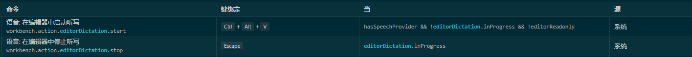

# vscode-extension-ts

This sample shows how to provide a walkthrough to the Getting Started section in vscode's welcome page.

## Getting Started： VSCode 快速语音笔记插件

> 当前支持的 vscode 版本不低于 v1.73.0

> 开发环境：VSCode v1.73.0， node v16.16.0

> 打包环境： node v18.20.0 (node 低版本报错 `ReferenceError: ReadableStream is not defined`)

## 需求

实现一个 VSCode 插件，其提供快捷键供用户创建新文件，并开启语音转文字模式，以记录一些突然迸发但现在没有时间做的灵感。

## 基本思想：敏捷迭代

- 解释：每轮开发过程只做最最核心的一个功能
- 原因：人的大脑没法想象太抽象的内容，把东西做出来有助于我们进一步的思考

## 需求拆解

第一步：Hello World

第二步：快速笔记 -> 1. 创建笔记文件 2. 打开笔记文件（供用户编辑）

第三步：触发语音输入 -> 触发 Voice: Start Dictation in Editor 命令  `workbench.action.editorDictation.start` (借助 VS Code 插件 `VS Code Speech` 的 api 实现)

第四步：快捷键 -> 如何用快捷键触发命令  `quickNote.createAndOpenNote` (`ctrl+shift+alt+n`)

第五步骤：插件打包 `npm run package` => `flash-notes-0.0.2.vsix`

### 小记录

1. 通过 `yo` 初始化项目的时候注意初始化版本号 package.json 里的 engines vscode 版本号与当前的编辑器是否匹配
2. `No workspace folder found. Please open a workspace first.` 警告是提醒我们需要在 f5 调试之后的工作区要打开一个文件夹
3. 编辑代码后在 VSCode 中按 `ctrl+shift+p` 打开命令面板，输入 `Developer: Reload Window` 重新加载窗口。

### Thanks

- [软件开发授人以渔 -- 15 分钟自己开发一个 VSCode 插件](https://www.bilibili.com/video/BV1BJ8SeMEbp/?spm_id_from=333.999.0.0&vd_source=b080c1e3a5d9d4c1b7d7de6c5e93368e)
- https://github.com/Ninglo/hello-world
